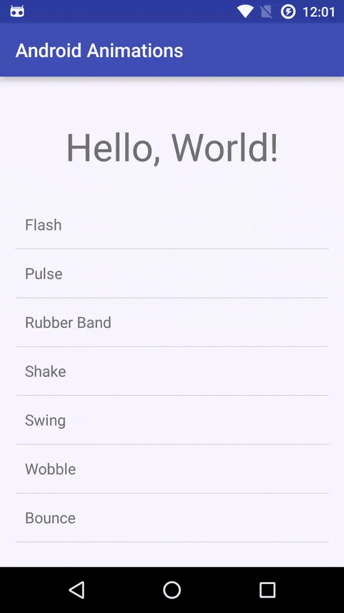
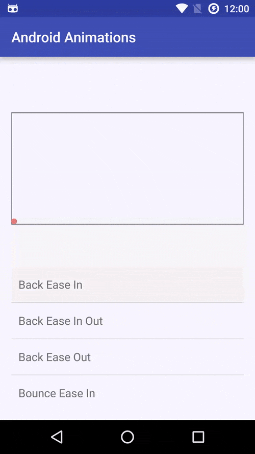
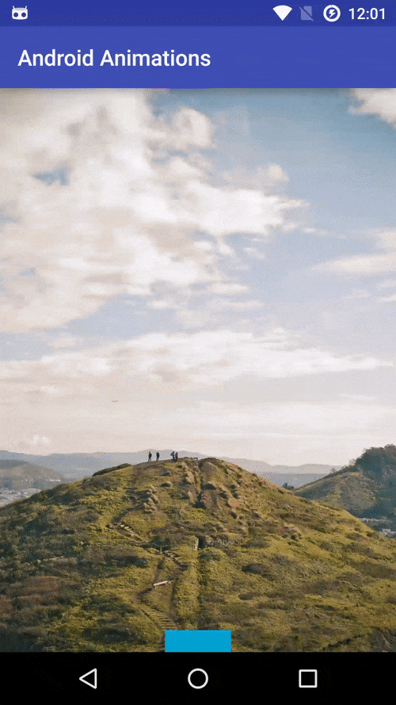

# AndroidAnimations

[](https://maven-badges.herokuapp.com/maven-central/com.jaredrummler/android-animations)
[](LICENSE)
[](https://android-arsenal.com/api?level=11) 
[](https://twitter.com/jaredrummler)

A bunch of fun animations for Android.

This project is based on [AndroidViewAnimations](https://github.com/daimajia/AndroidViewAnimations) and [AnimationEasingFunctions](https://github.com/daimajia/AnimationEasingFunctions) by [daimajia](https://github.com/daimajia). It was re-written for simplicity and to remove the dependency on noneoldandroids. #enumsmatter.

# Download

Download [the latest AAR](https://repo1.maven.org/maven2/com/jaredrummler/android-animations/1.0.0/android-animations-1.0.0.aar) or grab via Gradle:

```groovy
compile 'com.jaredrummler:android-animations:1.0.0'
```
or Maven:
```xml
<dependency>
  <groupId>com.jaredrummler</groupId>
  <artifactId>android-animations</artifactId>
  <version>1.0.0</version>
  <type>aar</type>
</dependency>
```

# Technique

## Usage:

```java
// play a bounce animation on a view
Technique.BOUNCE.playOn(view);

// customize a fade-in animation
Technique.FADE_IN.getComposer().duration(2500).delay(1000).playOn(anotherView);
```

## Demo:



## Available Techniques:

**Attention:**

`FLASH, PULSE, RUBBER_BAND, SHAKE, SWING, WOBBLE, BOUNCE, TADA, STAND_UP, WAVE`

**Special:**

`HINGE, ROLL_IN, ROLL_OUT, LANDING, TAKING_OFF, DROP_OUT`

**Bounce:**

`BOUNCE_IN, BOUNCE_IN_DOWN, BOUNCE_IN_LEFT, BOUNCE_IN_RIGHT, BOUNCE_IN_UP`

**Fade:**

`FADE_IN, FADE_IN_UP, FADE_IN_DOWN, FADE_IN_LEFT, FADE_IN_RIGHT, FADE_OUT, FADE_OUT_DOWN, FADE_OUT_LEFT, FADE_OUT_RIGHT, FADE_OUT_UP`

**Flip:**

`FLIP_IN_X, FLIP_OUT_X, FLIP_OUT_Y`

**Rotate:**

`ROTATE, ROTATE_IN, ROTATE_IN_DOWN_LEFT, ROTATE_IN_DOWN_RIGHT, ROTATE_IN_UP_LEFT, ROTATE_IN_UP_RIGHT, ROTATE_OUT, ROTATE_OUT_DOWN_LEFT, ROTATE_OUT_DOWN_RIGHT, ROTATE_OUT_UP_LEFT, ROTATE_OUT_UP_RIGHT`

**Slide:**

`SLIDE_IN_LEFT, SLIDE_IN_RIGHT, SLIDE_IN_UP, SLIDE_IN_DOWN, SLIDE_OUT_LEFT, SLIDE_OUT_RIGHT, SLIDE_OUT_UP, SLIDE_OUT_DOWN`

**Zoom:**

`ZOOM_IN, ZOOM_IN_DOWN, ZOOM_IN_LEFT, ZOOM_IN_RIGHT, ZOOM_IN_UP, ZOOM_OUT, ZOOM_OUT_DOWN, ZOOM_OUT_LEFT, ZOOM_OUT_RIGHT, ZOOM_OUT_UP`

# Skill

## Usage:

```java
AnimatorSet set = new AnimatorSet();
set.playTogether(Skill.BOUNCE_EASE_IN_OUT.glide(1200, ObjectAnimator.ofFloat(view, "translationY", 0, 100)));
set.setDuration(1200);
set.start();
```

## Demo:



## Available Skills:

**Back Easing:**

`BACK_EASE_IN, BACK_EASE_IN_OUT, BACK_EASE_OUT`

**Bounce Easing:**

`BOUNCE_EASE_IN, BOUNCE_EASE_IN_OUT, BOUNCE_EASE_OUT`

**Circ Easing:**

`CIRC_EASE_IN, CIRC_EASE_IN_OUT, CIRC_EASE_OUT`

**Elastic Easing:**

`ELASTIC_EASE_IN, ELASTIC_EASE_IN_OUT, ELASTIC_EASE_OUT`

**Expo Easeing:**

`EXPO_EASE_IN, EXPO_EASE_IN_OUT, EXPO_EASE_OUT`

**Quad Easing:**

`QUAD_EASE_IN, QUAD_EASE_IN_OUT, QUAD_EASE_OUT`

**Quint Easing:**

`QUINT_EASE_IN, QUINT_EASE_IN_OUT, QUINT_EASE_OUT`

**Sine Easing:**

`SINE_EASE_IN, SINE_EASE_IN_OUT, SINE_EASE_OUT`

**Other:**

`Linear`

# Rebound

A wrapper around Facebook's rebound.

## Usage:

```java
button.setOnTouchListener(new Rebound.SpringyTouchListener() {

  @Override public void onClick(View v) {
    // do stuff on click
  }
});
```

## Demo:



____

# Dependencies:

Rebound by Facebook
```groovy
compile 'com.facebook.rebound:rebound:0.3.8'
```

Support Annotations
```groovy
compile 'com.android.support:support-annotations:23.4.0'
```

License
--------

    Copyright (C) 2016. JRummy Apps Inc.

    Licensed under the Apache License, Version 2.0 (the "License");
    you may not use this file except in compliance with the License.
    You may obtain a copy of the License at

       http://www.apache.org/licenses/LICENSE-2.0

    Unless required by applicable law or agreed to in writing, software
    distributed under the License is distributed on an "AS IS" BASIS,
    WITHOUT WARRANTIES OR CONDITIONS OF ANY KIND, either express or implied.
    See the License for the specific language governing permissions and
    limitations under the License.
